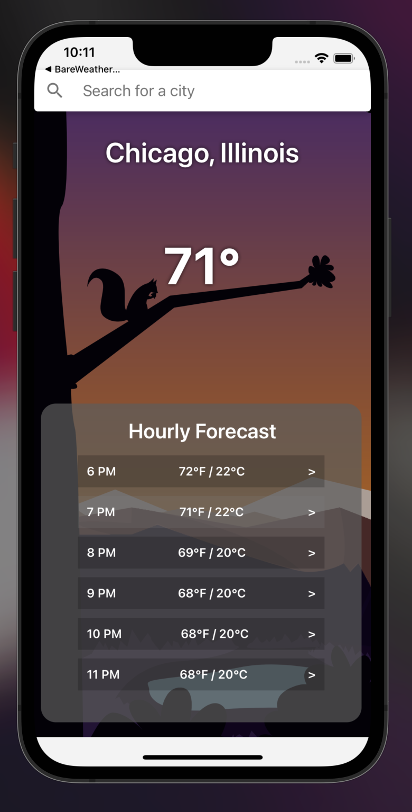

# Weather App Mobile

This example app uses [Rive](https://rive.app/) and [React Native](https://reactnative.dev/) to build a simple weather application using the API from [weatherapi.com](https://www.weatherapi.com/). The associated Rive file here is used as an animated background that changes with the weather conditions based on data from the API. The transitions between weather animations is done through the Rive state machine.

## Rive File

The Rive file used for this project can be found in the community post below:

https://rive.app/community/3113-6567-weather-app-demo/

## Project Organization

There are two folders here:

- BareWeatherApp
- WeatherApp

BareWeatherApp is a React Native starter project with some dependencies installed and initial setup already completed. This includes the Rive React Native runtime dependency, some other dev dependencies to enhance the project, and individual iOS configuration. While the logic for fetching data from the weather API is included, hooking up the Rive runtime and using the associated Rive file for the project is not. Follow along in the workshop here to see that in action!

WeatherApp is the completed version of the app with the Rive integration. Feel free to reference this to see how to integrate Rive files in the React Native project, as well as how to advance state machines based on API data responses.
